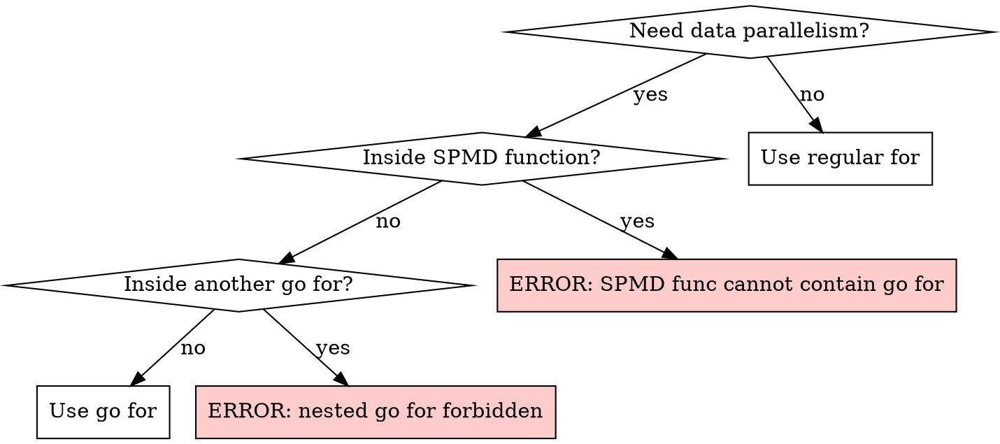
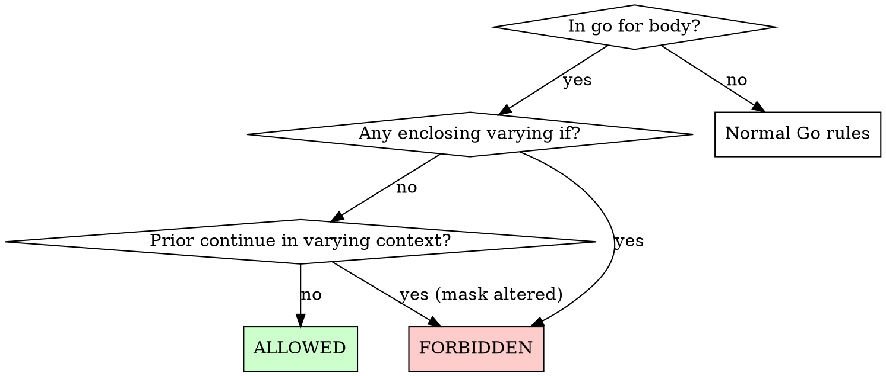

# Writing Go SPMD Code

## Overview

Go SPMD extends Go with Single Program Multiple Data support via `go for` loops and `lanes.Varying[T]` types. All lanes execute the same program on different data, with automatic masking for control flow divergence. This skill covers correct SPMD code patterns and vectorized algorithm design.

## Quick Reference

| Type | Lanes (WASM128) | Register |
|------|-----------------|----------|
| `int8`/`uint8`/`bool` | 16 | `<16 x i8>` / `<16 x i1>` |
| `int16`/`uint16` | 8 | `<8 x i16>` |
| `int32`/`uint32`/`float32` | 4 | `<4 x i32>` / `<4 x f32>` |
| `int64`/`uint64`/`float64` | 2 | `<2 x i64>` / `<2 x f64>` |

**Key:** `Varying[bool]` has 16 lanes, NOT 4. Lane count = 128 / bitwidth.

## Decision Flowcharts

### go for vs regular for

### return/break in go for

**Note:** `continue` is ALWAYS allowed in `go for`. Use `reduce.Any()`/`reduce.All()` to convert varying conditions to uniform for safe early exit.

## Hard Rules

1. **Assignment direction:** `uniform -> varying` OK (implicit broadcast). `varying -> uniform` FORBIDDEN.
2. **`go for` restrictions:** No nesting. SPMD functions (with varying params) cannot contain `go for`.
3. **Public API:** Exported functions cannot have `Varying[T]` parameters or return types.
4. **Return/break in `go for`:** Allowed only under purely uniform conditions with no prior mask alteration. See flowchart above.
5. **Upcast forbidden:** `Varying[int8]` -> `Varying[int32]` exceeds 128-bit register. Downcast is OK.
6. **`Varying[bool]` is 16 lanes:** 128 / 1-bit = 16, not 4. Platform mask format must not leak into type system.

## Red Flags

| Mistake | Correct Approach |
|---------|-----------------|
| `var u int = varyingVal` | Use `reduce.Add/Any/From` to extract uniform |
| `go for` inside `go for` | Flatten to single `go for`, or call SPMD function |
| `return` inside `if data[i] > 0` in `go for` | Use `continue` or `if reduce.Any(cond) { return }` |
| `func Export(x Varying[int])` | Make function private: `func export(x Varying[int])` |
| `Varying[int8](v32)` upcast | Only downcast: `Varying[int8](Varying[int32](x))` wrong |
| Confusing `go for` with `go func()` | `go for` = SPMD loop, `go func()` = goroutine |

## Supporting References

- **API Reference:** See `api-reference.md` for full `lanes` (12 funcs) and `reduce` (13 funcs) signatures
- **Patterns:** See `patterns.md` for 10 battle-tested idioms from real project examples
- **Vectorization:** See `vectorization.md` for ISPC mapping, algorithm suitability matrix, assembly-to-SPMD translation, and research pointers for designing new vectorized algorithms
- **Review Checklist:** See `review-checklist.md` for performance pitfalls (gather/scatter, AOS vs SOA, reduction placement, coherence), subtle correctness issues (continue/break semantics, aliasing, mask edge cases), and testing concerns
